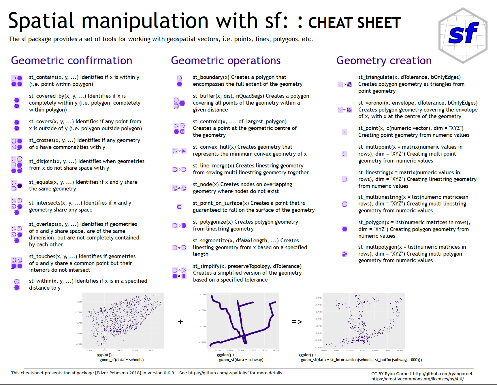

## Simple Features


## Simple Features

- Simple Feature Access
- ISO 19125-1 and ISO 19125-2
- 17 simple feature types (like point, line, polygon)

> “A simple feature is defined by the OpenGIS Abstract specification to have both spatial and non-spatial attributes. Spatial attributes are geometry valued, and simple features are based on 2D geometry with linear interpolation between vertices.”

More and more databases and software support Simple Features

- ArcGIS, QGIS
- SQL, Elasticsearch, MongoDB, … 
- R with the package `sf`

## Simple Features in R

- Implemented in the package `sf`.
- Provides simple features in data.frames or tibbles with a geometry list-column
- all 17 simple feature types for all dimensions (XY, XYZ, XYM, XYZM)
- https://github.com/r-spatial/sf
- Good replacement for `sp` and `gdal` packages.

```{r}
library(sf)
```

> "All functions and methods in sf that operate on spatial data are prefixed by `st_`, which refers to spatial and temporal; this makes them easily findable by command-line completion."

```{r echo=FALSE, message=FALSE, warning=FALSE, include=FALSE}
library(ggplot2)
```

## Simple Feature: POINT

```{r, echo = TRUE}
st_point(c(1,2))
```
```{r, echo=FALSE, message=FALSE, warning=FALSE}

sp <- st_point(c(1,2))
ggplot(sp) + 
  geom_sf(color="red") + 
  theme_bw() + 
  scale_x_continuous(limits = c(0, 2)) + 
  scale_y_continuous(limits = c(1.5, 2.5))
```

## Simple Feature: MULTIPOINT

```{r, echo = TRUE}
p <- rbind(c(3.2,4), c(3,4.6), c(3.8,4.4), c(3.5,3.8))
st_multipoint(p)
```

```{r, echo=FALSE, message=FALSE, warning=FALSE}
p <- rbind(c(3.2,4), c(3,4.6), c(3.8,4.4), c(3.5,3.8))
(mp <- st_multipoint(p))
ggplot(mp) + 
  geom_sf(color="red") + 
  theme_bw() + 
  scale_x_continuous(limits = c(2, 6)) + 
  scale_y_continuous(limits = c(3, 5))
```


## Simple Feature: LINESTRING

```{r, echo = TRUE}
s1 <- rbind(c(0,3),c(0,4),c(1,3),c(2,5))
st_linestring(s1)
```

```{r, echo=FALSE, message=FALSE, warning=FALSE}
s1 <- rbind(c(0,3),c(0,4),c(1,3),c(2,5))
(ls <- st_linestring(s1))
ggplot(ls) + 
  geom_sf(color="red") + 
  theme_bw() + 
  scale_x_continuous(limits = c(-1, 3)) + 
  scale_y_continuous(limits = c(3, 5))
```

## Simple Feature: MULTILINESTRING

```{r, echo = TRUE}
s1 <- rbind(c(0,3),c(0,4),c(1,3),c(2,5))
s2 <- rbind(c(0,4.4), c(0.6,5))
st_multilinestring(list(s1,s2))
```

```{r, echo=FALSE, message=FALSE, warning=FALSE}
s1 <- rbind(c(0,3),c(0,4),c(1,3),c(2,5))
s2 <- rbind(c(0,4.4), c(0.6,5))
mls <- st_multilinestring(list(s1,s2))

ggplot(mls) + 
  geom_sf(color="red") + 
  theme_bw() + 
  scale_x_continuous(limits = c(-1, 3)) + 
  scale_y_continuous(limits = c(3, 5))
```

## Simple Feature: POLYGON

```{r, echo = TRUE}
p <- rbind(c(0,0), c(1,0), c(3,2), c(1,4), c(0,0))
h <- rbind(c(1,1), c(1,2), c(2,2), c(1,1))
st_polygon(list(p,h))
```

```{r, echo=FALSE, message=FALSE, warning=FALSE}
p <- rbind(c(0,0), c(1,0), c(3,2), c(1,4), c(0,0))
h <- rbind(c(1,1), c(1,2), c(2,2), c(1,1))
(pol <-st_polygon(list(p,h)))
ggplot(pol) + 
  geom_sf(fill="red", colour="red") + 
  theme_bw() + 
  scale_x_continuous(limits = c(-2, 6)) + 
  scale_y_continuous(limits = c(0, 4))
```


## Simple Feature: MULTIPOLYGON

```{r, echo = TRUE}
p1 <- rbind(c(0,3), c(0,4), c(1,4), c(1,3), c(0,3))
p2 <- rbind(c(3,2), c(2,3), c(3,3), c(3,2))
st_multipolygon(list(list(p1), list(p2)))
```

```{r, echo=FALSE, message=FALSE, warning=FALSE}
p1 <- rbind(c(0,3), c(0,4), c(1,4), c(1,3), c(0,3))
p2 <- rbind(c(3,2), c(2,3), c(3,3), c(3,2))
(mpol <- st_multipolygon(list(list(p1), list(p2))))
ggplot(mpol) + 
  geom_sf(fill="red", colour="red") + 
  theme_bw() + 
  scale_x_continuous(limits = c(0, 4)) + 
  scale_y_continuous(limits = c(2, 4))
```

## Spatial operations

Geometric Confirmation:

- `st_overlaps`, `st_contains`, `st_disjoint`

Geometric Operations

- `st_centroid`, `st_convex_hull`, `st_line_merge`

Geometry Operations

- `st_intersection`, `st_difference`, `st_union`

Geometric measurement

- `st_distance`, `st_area`

## Spatial operations - Intersection

Define two polygons `a` and `b`. 
```{r, echo = TRUE}
(a <- st_polygon(list(rbind(
  c(0, 0), c(0, -1), c(7.5, -1), c(7.5, 0), c(0, 0)
))))

(b <- st_polygon(list(rbind(
  c(0,1), c(1,0), c(2,.5), c(3,0), c(4,0), 
  c(5,0.5), c(6,-0.5), c(7,-0.5), c(7,1), c(0,1)
))))
```

## Spatial operations - Intersection

Define two polygons `a` and `b`. 

```{r, echo = TRUE}
plot(a, ylim = c(-1,1))
plot(b, add = TRUE, border = 'red')
```

## Spatial operations - Intersection

```{r, echo = TRUE}
int_a_and_b <- st_intersection(a,b)
int_a_and_b
```
GEOMETRYCOLLECTION

  - POINT (1 0)
  - LINESTRING (4 0, 3 0)
  - POLYGON ((5.5 0, 7 0, 7 -0.5, 6 -0.5, 5.5 0))

## Spatial operations - Intersection

```{r, echo = TRUE}
plot(a, ylim = c(-1,1))
plot(b, add = TRUE, border = 'red')
plot(int_a_and_b, add = TRUE, col = 'green', lwd = 2)
```

## Simple features and data.frames


## Simple features and data.frames

> "We usually do not work with geometries of single simple features, but with datasets consisting of sets of features with attributes."

\footnotesize
```{r}
file_name <- system.file("shape/nc.shp", package="sf")

nc <- st_read(file_name)
```
\normalsize

## Simple features and data.frames

\footnotesize
```{r}
head(nc[,c("CNTY_ID", "NAME")])
```
\normalsize

## Simple features and data.frames


## Simple Features and GIS

- Geographic information system
- The package `sf` is very powerfull for building maps.
- Present spatial or geographic data

- It's not (yet) a replacement of ArcGIS of QGIS.


## Example - OpenStreetMap (OSM)

The `osmdata` package helps with extracting data from OpenStreetMap.

\footnotesize
```{r message=FALSE, warning=FALSE}
library("osmdata")
```
\normalsize


## Example - OpenStreetMap (OSM)

\footnotesize
```{r}
utrecht_sf <- opq(bbox = 'utrecht nl') %>%
  add_osm_feature(key = 'highway', value = 'cycleway') %>%
  osmdata_sf()

utrecht_sf
```
\normalsize

## Example - OpenStreetMap (OSM)

```{r eval=FALSE, message=FALSE, warning=FALSE}
library(ggplot2)

ggplot() + 
  geom_sf(
    data=utrecht_sf$osm_lines, 
    fill="darkgreen", 
    color="darkgreen"
  )
```

## Example - OpenStreetMap (OSM)

```{r echo=FALSE, message=FALSE, warning=FALSE}
library(ggplot2)

ggplot() + 
  geom_sf(
    data=utrecht_sf$osm_lines, 
    fill="darkgreen", 
    color="darkgreen"
  )
```

## Example - CBS Dutch municipalities

The `osmdata` package helps with extracting data from OpenStreetMap.

\footnotesize
```{r message=FALSE, warning=FALSE}
library("cbsshape")
library("dplyr")
```

```{r}
# download 2017 data
wijk_en_buurt_2017 <- st_read_cbs(2017, "data/") # remove "data/"  
```

## Example - CBS Dutch municipalities

Extract the geometry of Utrecht
```{r}
sf_cbs_utrecht <- wijk_en_buurt_2017 %>% 
  # remove water polygons
  filter(WATER == "NEE", GM_NAAM == "Utrecht") %>%
  st_geometry()
```

CBS works with RD coordinates (not the typical longitude and latitude)
```{r}
sf_cbs_utrecht <- st_transform(sf_cbs_utrecht, 4326) 
# 4326 is wgs84
```


## Example - CBS Dutch municipalities

```{r, eval=FALSE}
ggplot(sf_cbs_utrecht) + 
  geom_sf(color="red", alpha=0) + 
  geom_sf(
    data=utrecht_sf$osm_lines, 
    fill="darkgreen", 
    color="darkgreen"
  )
```

## Example - CBS Dutch municipalities

```{r, echo=FALSE}
ggplot(sf_cbs_utrecht) + 
  geom_sf(color="red", alpha=0) + 
  geom_sf(
    data=utrecht_sf$osm_lines, 
    fill="darkgreen", 
    color="darkgreen"
  )
```


## Example - ggmap

```{r message=FALSE, warning=FALSE}
library(ggmap)
```

```{r}
st_bbox(sf_cbs_utrecht)
```

```{r message=FALSE, warning=FALSE}
utrecht_map <- get_map(
  c(left = 4.970470, 
    bottom = 52.027255, 
    right = 5.195562 , 
    top = 52.143037
  ), 
  maptype = "toner-background")
```

## Example - ggmap

```{r}
ggmap(utrecht_map)
```

## Combine OSM, CBS, ggmap

```{r message=FALSE, warning=FALSE, eval=FALSE}
ggmap(utrecht_map) + 
  geom_sf(data=sf_cbs_utrecht,
          color="red",
          alpha=0,
          inherit.aes =FALSE) + 
  geom_sf(
          data=utrecht_sf$osm_lines, 
          inherit.aes =FALSE,
          fill="darkgreen", 
          color="darkgreen"
  )
  
```

## Combine OSM, CBS, ggmap

```{r message=FALSE, warning=FALSE, echo=FALSE}
ggmap(utrecht_map) + 
  geom_sf(data=sf_cbs_utrecht,
          color="red",
          alpha=0,
          inherit.aes =FALSE) + 
  geom_sf(
          data=utrecht_sf$osm_lines, 
          inherit.aes =FALSE,
          fill="darkgreen", 
          color="darkgreen"
  )
  
```


## Combine OSM, CBS, ggmap - Intersection

\footnotesize
```{r message=FALSE, warning=FALSE}
(cycle_utrecht <- st_intersection(
  sf_cbs_utrecht, 
  utrecht_sf$osm_lines
))
```
\normalsize

## Combine OSM, CBS, ggmap - Plotting


```{r eval=FALSE, message=FALSE, warning=FALSE}
ggmap(utrecht_map) + 
  geom_sf(data=sf_cbs_utrecht,
          color="red",
          alpha=0,
          inherit.aes =FALSE) + 
  geom_sf(
          data=cycle_utrecht, 
          inherit.aes =FALSE,
          fill="darkgreen", 
          color="darkgreen"
  )
  
```

## Combine OSM, CBS, ggmap - Result

```{r echo=FALSE, message=FALSE, warning=FALSE}
ggmap(utrecht_map) + 
  geom_sf(data=sf_cbs_utrecht,
          color="red",
          alpha=0,
          inherit.aes =FALSE) + 
  geom_sf(
          data=cycle_utrecht, 
          inherit.aes =FALSE,
          fill="darkgreen", 
          color="darkgreen"
  )
  
```

## Resources and examples

1. Simple Features for R
https://r-spatial.github.io/sf/articles/sf1.html

2. Reading, Writing and Converting Simple Features
https://r-spatial.github.io/sf/articles/sf2.html

3. Manipulating Simple Feature Geometries
https://r-spatial.github.io/sf/articles/sf3.html

4. Manipulating Simple Features
https://r-spatial.github.io/sf/articles/sf4.html

5. Plotting Simple Features
https://r-spatial.github.io/sf/articles/sf5.html

6. Miscellaneous
https://r-spatial.github.io/sf/articles/sf6.html


## Resources and examples



## Resources and examples

https://dominicroye.github.io/en/2018/accessing-openstreetmap-data-with-r/


## Questions?

- How to build heatmaps?
- How to enrich data with demographic data of National Statistics?
- How to convert address information into coordinates?
- ...
