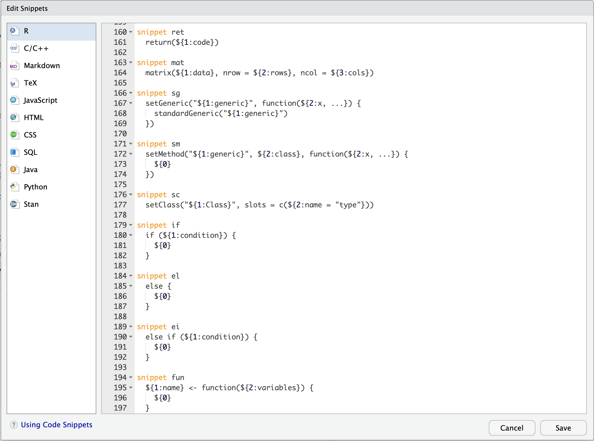

```{r setup, include=FALSE}
knitr::opts_chunk$set(echo = FALSE)


library(tidyverse)
```

## Tricks to improve your workflow in RStudio


- RStudio is an IDE: Integrated Development Environment
- Interface to R

Lots of useful features

- Reformat Code
- Keyboard Bindings 
  - https://support.rstudio.com/hc/en-us/articles/206382178
- Code Snippets 
  - https://support.rstudio.com/hc/en-us/articles/204463668-Code-Snippets

## Snippets 

- A snippet is a programming term for a small region of re-usable source code, machine code, or text. (Wikipedia, 2019)

- Avoid repetitive typing in the course of routine edit operations.

- Snippet programming 

## Snippet programming in R

- Tools > Global Options > Code > Snippets



## Snippet programming in R: The syntax (1)

- Static snippets

```{r, eval=F, echo=T}

snippet libs "My default libraries"
	
  library(tidyverse)
  library(survival)
  library(parallel)

```

## Snippet programming in R: The syntax (2)

- Dynamic snippets

```{r, eval=F, echo=T}

snippet def "Simple function with print"
	${1:name} <- function(${2:variables}) {
		
		print(${2:variables})
		
		${0}
	}

```

## Snippet programming in R: The syntax (3)

- Scriptable snippets

```{r, eval=F, echo=T}

snippet libtidy "Load tidyverse library"
  # Tested with tidverse v`r packageVersion("tidyverse")`
  library(tidyverse)
  ${0}

```

## Examples: Headers and Sections

```{r, eval=F, echo=T}

snippet header
	# `r rstudioapi::getActiveDocumentContext()[["path"]]`
	# 
	# Author: Jonathan de Bruin
	# Project: ${1:project_name}
	# Creation date: `r Sys.Date()`
	# Modification date: `r Sys.Date()`
	# 
	# Description: ${2:description}
	#
	
	${0}
```

## Examples: Headers and Sections (results)

```{r, eval=T, echo=T}

# mysnippets.R
# 
# Author: Jonathan de Bruin
# Project: Snippets presentation
# Creation date: 2019-03-25
# Modification date: 2019-03-25
# 
# Description: This is the header of my file 
#              on snippets in R.
#
```

## Examples: Data transformation

```{r, eval=F, echo=T}

snippet agg
	${1:data} %>%
		group_by(${2:vars}) %>%
		summarise(
			${3:summarise}
		)
		
	${0}
```

## Examples: Data transformation (result)

```{r, eval=T, echo=T}
iris %>%
  group_by(Species) %>%
  summarise(
    max_petal_length = max(Petal.Length),
    min_petal_length = min(Petal.Length)
  )
```


## Examples: Statistics

```{r, eval=F, echo=T}

snippet anova "anova"
	data.aov <- aov(${1:formula}, data=${2:data})
	summary(data.aov)
	
	${0}

```

## Examples: Statistics (results)

```{r, eval=T, echo=T}

data.aov <- aov(Petal.Length ~ Species, data=iris)
summary(data.aov)

```

## Snippet management

Location

- R Snippets are stored under `~/.R/snippets/r.snippets`

Share

- Share your snippets with colleagues
- Download useful snippets from Github

Management

- snippr: publish, install, and share RStudio code snippets


